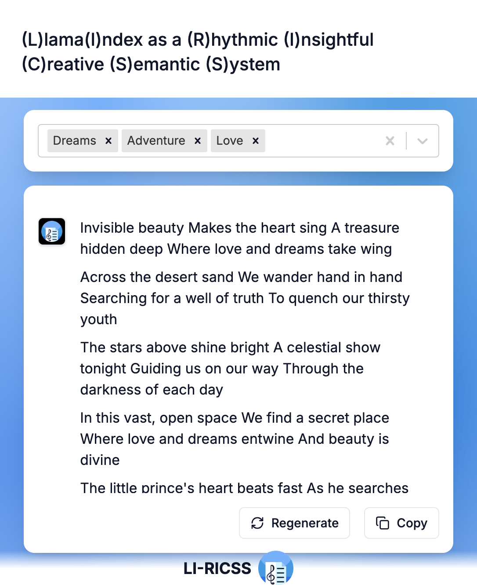

# li-ricss

(L)lama(I)ndex as a (R)hythmic (I)nsightful (C)reative (S)emantic (S)ystem

Explore the enchanting world of mesmerizing poetry and song lyrics, a pioneering project that generates such content.
Dive into a symphony of words, where each creation resonates with unique rhythm and profound meaning.

Based on the [rag-stream-intermediate-events-tutorial](https://github.com/rsrohan99/rag-stream-intermediate-events-tutorial)

We use Server-Sent Events which will be recieved by Vercel AI SDK on the frontend.

## Demo (Preview)

### Videos

[demo1](preview/demo1_init.mp4)

[demo2](preview/demo2_gen-song.mp4)

[demo3](preview/demo3_regen-song.mp4)

[demo4](preview/demo4_copy.mp4)

### Mobile View



## Usage

### Requirements

- python3.11 (3.11.7)
- node 21 (21.7.3)
- npm 10 (10.5.0)

### Getting Started

- Clone the repo:

```bash
git clone git@github.com:raisga/li-ricss.git

cd li-ricss
```

#### Backend

- `cd` into the `backend` directory

```bash
cd backend
```

- Create `.env` from `.env.example`

```bash
cp .env.example .env
```

- Install the dependencies

For mac users

```bash
brew install poetry
```

```bash
poetry install
```
- Generate the Index for the first time

```bash
poetry run python app/engine/generate.py
```

- Start the backend server

```bash
poetry run python main.py
```

#### Frontend

- `cd` into the `frontend` directory

```bash
cd frontend
```

- Create `.env` from `.env.example`

```bash
cp .env.example .env
```

- Install the dependencies

```bash
npm i
```

- Start the frontend server

```bash
npm run dev
```
